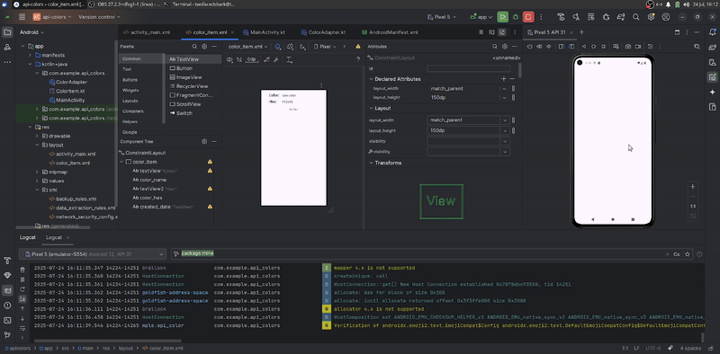

# AND101 Project 6 - CYOAPI Part 2: RecyclerView Edition

Submitted by: **Maximiliano Ovalle**

Time spent: **2** hours spent in total

## Summary

**Scrollable** is an android app that **displays data retrieved from Colours API in the form of a scrolling UI**!

## Application Features

The following REQUIRED features are completed:

- [x] Make an API call to an API of your choice using AsyncHTTPClient
- [x] Implement a RecyclerView to display a list of entries from the API
- [x] Display at least three (3) pieces of data for each RecyclerView item

## Video Demo

Here's a video / GIF that demos all of the app's implemented features:

## License

Copyright **2025** **Maximiliano Ovalle**

Licensed under the Apache License, Version 2.0 (the "License");
you may not use this file except in compliance with the License.
You may obtain a copy of the License at

    http://www.apache.org/licenses/LICENSE-2.0

Unless required by applicable law or agreed to in writing, software
distributed under the License is distributed on an "AS IS" BASIS,
WITHOUT WARRANTIES OR CONDITIONS OF ANY KIND, either express or implied.
See the License for the specific language governing permissions and
limitations under the License.